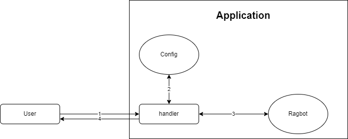

# Webiks-Hebrew-RAGbot-Demo

## Overview

This project is a FastAPI-based application that integrates with Elasticsearch and a rag-bot to perform various document-related operations.
It includes endpoints for searching, updating, and rating documents, as well as handling configurations and updates.
this projects integrates with [Webiks-Hebrew-RAGbot](https://github.com/NNLP-IL/Webiks-Hebrew-RAGbot) project.
You need to have a retrival model. You can get it from [here](https://drive.google.com/file/d/1eFAddJWBWDvoid-Gyn6ZT5jPwf-vNPI8/view).
You can train model by yourself. You can see the train code [here](https://github.com/NNLP-IL/Webiks-Hebrew-RAGbot-Trainer).

## Setup

1. Setup the Elasticsearch DB on the cloud or on your local Docker and place your credentials in the .env file
2. Add the index name of the docs in the .env file.
3. Seed the database with docs using the /initialize_elastic_from_json route.
4. Seed your first configurations for the model using the /set_config route. See /set_config’s documentation below.

## Flow of Project



1. The user submits a question using the /search route.
2. The question is forwarded to the ragbot.
3. Ragbot returns paragraphs and chains them to llm_client.
4. llm_client generates responses from Llm and sends them back to the user, along with the paragraphs and associated metadata.
5. The app stores the answer in the database, along with the question, the docs and some additional details. See /search route’s documentation below.
6. If the user rates the answer, this rating is sent to the app, which then stores it linked to the specific answer. See the /rating route’s documentation below.

## Project Structure

- **app/src/**: Main application files.
- **app/.env**: Environment variables for the project. You can find an example file included in the project.

## Installation

1. Clone the repository.
2. Ensure you have python 3.10 installed (and not a higher version).
3. Create a virtual environment: `python -m venv .venv`
4. Create a .env file in app/ directory.
5. Create a new directory in app/ named "artifacts".
6. Add the [retrival model](https://drive.google.com/file/d/1eFAddJWBWDvoid-Gyn6ZT5jPwf-vNPI8/view) to the new artifacts directory.
7. Install the required packages: `pip install -r requirements.txt`
8. Create a docker container for Elasticsearch using the command (change the %%path_to_project%% to your path).
9. Add the paragraphs corpus to the base directory. You can find it [here](https://github.com/NNLP-IL/Webiks-Hebrew-RAGbot-KolZchut-Paragraph-Corpus).
10. Run the project and seed the db using the /initialize_elastic_from_json route.

```
docker run -e "discovery.type=single-node" -e "xpack.security.enabled=false" -e "ES_JAVA_OPTS=-Xms2g -Xmx2g" -p 9200:9200 -v %%path_to_project%%/app/data/elastic/data:/usr/share/elasticsearch/data elasticsearch:8.12.2
```

## Running

### App

```
uvicorn app.src.main:app --host 0.0.0.0 --port 5000
```


## Endpoints

### Health Check

`GET /health`
Returns a 200 status code if the service is running.

### Get Configuration

`GET /get_config`
Search for the last configuration in the db. Returns the current configuration.

### Set Configuration

`POST /set_config`
**Body:**
`{ "model": "string, optional", "num_of_pages": "integer, optional", "temperature": "float, more than 0, less than 1, optional", "user_prompt": "string, optional", "system_prompt": "string, optional" }`
Updates the configuration with the provided parameters. If some of the parameters don't exist - it sets them as the
previous config.

### Search

`POST /search`
**Body:**
`{ "query": "string", "asked_from": "string (url)" }`
Performs a search query and returns the results.

### Initialize Elastic from JSON

`GET /initialize_elastic_from_json`
Initializing the data from the corpus to the elastic. Recommended to execute before first search run.

### Operate Documents

`POST /operate_docs`
**Body:** `{
  "operation": str("create" or "delete" only),
  "documents": [
    { "doc_id": number, "title": "string", "link": "string", "content": "string" }
  ]
}
`.
Handles document operations by creating or updating documents.

### Delete Document

`DELETE /delete_doc?doc_id={number}&obj_id={number}`
**Query:** doc_id: Document ID to delete.
obj_id: The index of the document to delete.
Deletes document using the provided document's parameters

### Get Doc

`GET /get_doc?doc_id={number}`
**Query:** doc_id: The document ID you want to retrieve.
